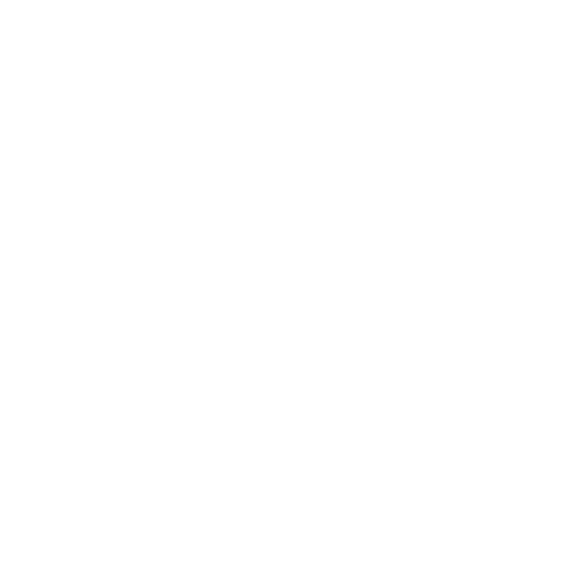
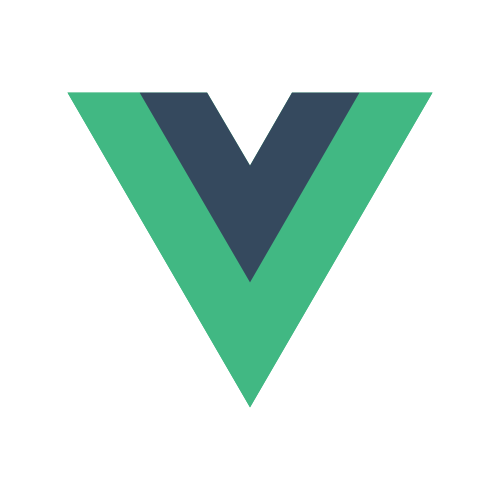

  <!-- Typing SVG by DenverCoder1 - https://github.com/DenverCoder1/readme-typing-svg -->
  

  <!-- Typing SVG by DenverCoder1 - https://github.com/DenverCoder1/readme-typing-svg -->
  

### Hi there 👋

My name is Grigorii, I'm a full stack developer. I have a some personal projects as well as rich experience in commercial development.

### Field of activity

#### Full stack development
- Backend: Python (Django + DRF, FastAPI), TypeScript (NestJS)
- Frontend: TypeScript (Svelte, React, Vue 3)

#### Programming languages

  
  
  
  

#### Primary skills (have rich experience)

  
  
  
  
  

- React
- ElectronJS
- NestJS
- GraphQL (with Nestjs integration) & Apollo client (react)
- ThreeJS, React three fiber
- Databases (SQLite, MySQL, Postgres)
- JWT auth
- ORM (TypeORM, Ktorm)
- Communication with COM/HID ports

#### Secondary skills (have minor experience)

  
  
  
  
  
  

- _NextJS_
- _NextAuth_
- Vue composition
- Svelte
- Linux
- Devops (Docker, deploying)
- CI/CD

#### Soft skills

- Mentorship
- Project lead developer

### Projects information and contacts

I develop complex SPA applications, standard websites with backend, and desktop applications.

☎ You can reach me via [telegram](https://t.me/osx11)

